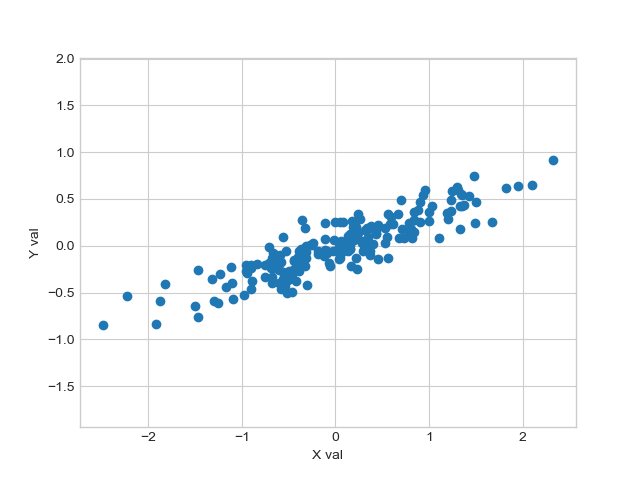
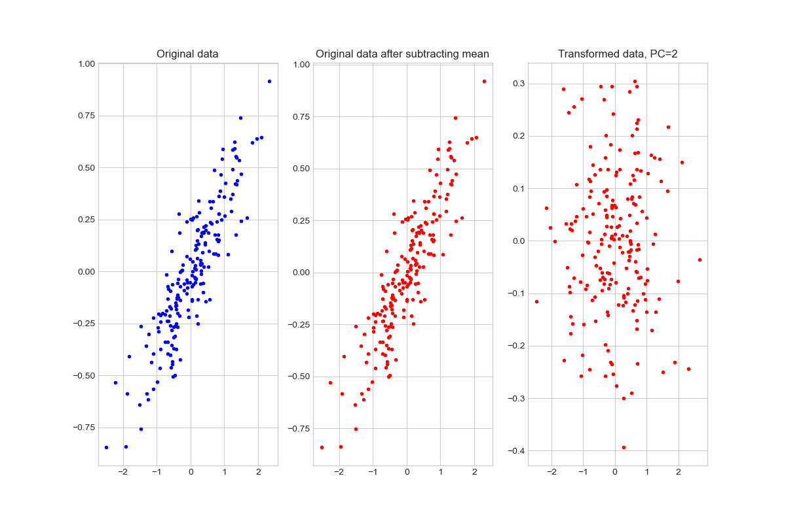

# _Python for Scientific Data Analysis_

## Homework # 4 (October 12)

### 1. Broadcasting

Consider two arrays

```
arr1=np.array([[1,2,3],[4,5,6],[7,8,9]])
```
and

```
arr2=np.array([79,89,99])
```

write a line(s) of code that ...

a) replaces each column of arr1 by arr2

b) replaces each row of arr1 by arr2

c) replaces only the 1st and 2nd column (counting from zero) of arr by arr2


### 2. Repeating Array Elements

take the array a=np.array([10,20,30,40,50]) ...

part 1

* use ``np.tile`` to repeat this entire array 5 times
* use ``reshape`` to convert this array into a 2-D matrix.   With the ``reshape`` command use i) the length of ``a``  (i.e. ``len(a)``) and ii) ``-1`` to do the reshaping instead of hardcoding the dimensions.
* take the determinant of this matrix and report the result.  

part 2

* now take the determinant of the matrix 
 ``a=np.array([[1,2.333,-4],[-4,-3,-.001],[-.2,5.3,9.99]])``
 
part 3
 
* now, flatten the array in part 2:

you should get ``aflat=array([ 1,  2.333, -4, -4, -3,
       -0.001, -.2,  5.3,  9.99])``
       
use ``np.tile`` to repeat this array 
 nine times and follow the steps in part 1 to compute the determinant.  Notice a pattern?
 
### 3. Solving a System of Linear Equations

Consider this system of linear equations :

8$a_{o}$ + 6$a_{1}$ - 10$a_{2}$ = 2

-4$a_{o}$ - 8$a_{1}$ + 10$a_{2}$ = 5

16$a_{o}$ + 16$a_{1}$  = -3

* Solve this system of equations with i) ``np.linalg.solve`` and ii) ``np.linalg.inv`` + ``np.dot``

* Verify that the values for $a_{o}$, $a_{1}$, and $a_{2}$ provide an exact solution.


### 4. Eigendecomposition 

- construct a 3x3 matrix with elements

 ```
       [40, 42.5, 45, 47.5, 50, 52.5, 55, 57.5, 60 ]
 ```
 
 using the ``np.linspace`` and ``reshape`` functions.
 
 - perform eigendecomposition on this matrix.

  - what is the rank of the original matrix?   Why is the answer not 3?

 
### 5. Eigendecomposition 

- construct a 3x3 matrix with elements 

```
[16, 18.0625, 20.25,22.5625, 25, 27.5625, 30.25, 33.0625, 36]

```

using the ``np.linspace`` and ``reshape`` functions (hint: 4$^{2}$=16, 5$^{2}$=25, and 6$^{2}$=36).

 - confirm the formulas  $\textbf{A}$ = $\textbf{V}\Lambda\textbf{V}^{-1}$ and $\Lambda$= $\textbf{V}^{-1}\textbf{A}\textbf{V}$ using this matrix as $\textbf{A}$.


### 6. PCA

- Take the data shown in our first plot of the PCA lecture notes:
```
rng = np.random.RandomState(1)
X = np.dot(rng.rand(2, 2), rng.randn(2, 200)).T
```




Perform PCA on these data to produce the following plot:




Use the source code in ``pcademo3.py`` for plotting and guidance. 

**Hints**

- look at the notes and the source code for ``pcademo3.py``.  In particular, look at where the PCA steps start (denoted by "Step 1").   What variable do you need to drop in here and then mean-subtract?
-  There should be a block of code that produces the plot.   You can figure it out if you know what each variable stands for (i.e. if you can read the source code).  If not, putting in some commment lines to figure out where it is.
-  To make the appearance of the plot match what we want, you need to set the x and y limits properly.  The block of code that will do this is:

```
  # Set x ticks
  xl=ax[0].get_xlim()
  yl=ax[0].get_ylim()
  ax[1].set_xlim(xl)
  ax[1].set_ylim(yl)
  ax[2].set_xlim(-2.75,2.75)
  ax[2].set_ylim(-0.425,0.325)
  
```


### 7. PCA and SVD

Part 1

- Create an array of random numbers with dimensions (7,3) ...

- perform PCA on this array (remember all of the steps to PCA).  

To produce a (3,3) covariance matrix, I recommend you do ``np.matmul(array.T,array)`` where "array" is your mean-subtracted array.  

- starting with the _mean\_subtracted_ version of the above array, perform SVD
-  Compare the eigenvectors computed from PCA to the matrices computed from SVD.  Are there any similarities?
-  Compare the eigenvalues computed from PCA to the singular values computed from SVD.   Are there any similarities or correlations?

Part 2
- Repeat part 1 except for a random (9,3) array.   


What conclusions can you draw about PCA and eigendecomposition vs SVD from these results?


### 8. A Simple PCA Calculation  

Start with the following array:

```
data=np.array([[7., 4., 3.],
               [4., 1., 8.],
               [6., 3., 5.],
               [8., 6., 1.],
               [8., 5., 7.],
               [7., 2., 9.],
               [5., 3., 3.],
               [9., 5., 8.],
               [7., 4., 5.],
               [8., 2., 2.]])
```

Create a Python script (a file that will end with ".py") containing a single Python **function** that performs PCA (steps 1--5), including the number of principal components as a keyword variable.   

Demonstrate how to execute the function.   Run it where you retain i) 3 principal components and ii) 5 principal components.   Include a print statement within the function to print out the results.

(**Note**: don't overthink this question.  I'm just asking you to write code to do a simple PCA calculation.   It's really just making sure you remember how to do PCA -- which you should since we are just covering it -- _and_ write Python functions, which we covered during the first week of class.)
 
### 9. Applications of PCA 

This one is a bit more involved.  In our course notes, we showed an application of using PCA  used in a machine learning algorithm trained on a set of digits to then classify noisy digits.  I gave one canned example of a nPCA = 50 transform of noisy versions of the digits set leading to a reduced (70%) classification accuracy. 

Now ...

*  write a Python function to perform the same classification on the same noisy digits -- i.e. using

```
np.random.seed(42)
noisy = np.random.normal(digits.data, 5)
```
to make the digits noisy ...

where the number of PCs is a free parameter that you set when calling the function

* do an iteration -- from 1 PC to 64 PCs -- returning the value of the classification accuracy

* plot up the results, e.g.

```
plt.plot(npca,accuracy)
plt.show()

```
* repeat the above but add the 'noisiness' as a free parameter for the function, e.g. 
where in part #1 it is 5 but in this part you set it to 15 here.

-which range of PCs give the most accurate model prediction in both cases?
-Which trends to do you see?